# One Signature, Many Runs: Seven Days of OpenZaps

**21–28 July 2026 · Robinhood Chain (chain id 4663)**

*Disclosure: I work on this protocol. Discount accordingly.*

---

**tl;dr.** In the last seven days OpenZaps went from single-shot execution — one signed intent, one
run — to a full automation stack: recurring and price-triggered runs, a relative price floor computed
at execution, a reference
executor, an intent relay, a universal creation-fee gateway, and an agent surface that ships no
credential because there is nothing to ship. It also shipped a game, discovered the game had quietly
taken 2,000,000 0xZAPS off two players without telling them, and spent four commits and an
adversarial review closing every path to that outcome. Everything below is live on chain 4663 and
**none of it has an external audit.** The most instructive part of the week is section 6, and it is
not a success story.

---

## 1. What a Zap is, in one paragraph

A Zap is a per-user contract holding your funds and a frozen action graph. There is no
`call(target, value, data)` anywhere in the interface — the only policy-directed external action is a
fixed-selector adapter call with calldata welded in at deployment. The recipient, the adapters, the
input tokens, and the amounts are set once, atomically with the `CREATE2` deploy, into write-once
storage. Your later signature adds only the run-scoped fields: settlement asset, minimum output,
deadline, relayer fee.

That is the whole idea, and it is worth stating why it is not just a smaller session key. A
validator over a generic call is a *filter*, and filters fail open — every new protocol integration
and every downstream upgrade is another chance to admit a call nobody anticipated. OpenZaps deletes
the set being filtered. You pay for that in expressiveness, one clone deployment per policy, and
this week was mostly about buying expressiveness back without giving the property away.

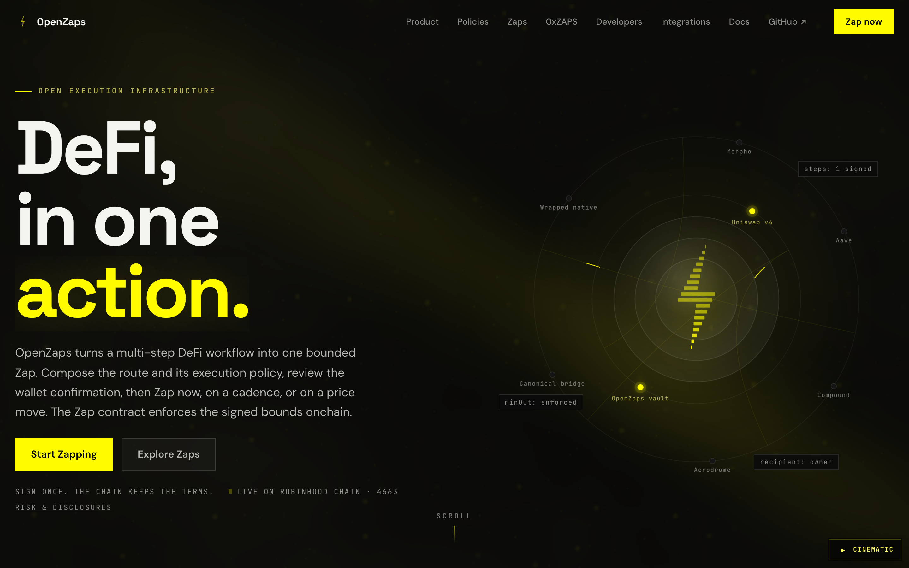

## 2. Automation without a standing approval

The v3 stack went live at block 17,601,632 on 23 July and added the two execution types the design
had been missing:

- **Recurring** — a cadence, a run count, and a per-run amount, all frozen in the policy.
- **Price-triggered** — a condition read from an allowlisted onchain price source at execution.

| | |
|---|---|
| OpenZapFactoryV3 (`3.0.0-candidate`) | `0x70FCFD3615eA6651a670B6c4CD6B8bA1506717e9` |
| ZapLotteryPot | `0xeB7a15CE1c969efBA43ecfc1A63960Ad0042CFe3` |
| V4PoolPriceSource (aeWETH/0xZAPS) | `0x60C310586541763D7f4dcc777F495f0627Bb098f` |

The factory reuses the live v1.1 `AdapterRegistry` and `TokenAllowlist`, so there is one governance
surface for adapters and tokens rather than two that can disagree. The new registry instance governs
trigger price sources only.

Then v3.1, the next day, because v3 had a real bug that a live zap hit: **an absolute output floor
goes stale.** Sign a recurring series with `minOut` fixed at today's price and a few runs later that
floor is either meaningless or blocking, depending on which way the market went.
`executeRecurringRelative` computes the floor per run from
the oriented price source's spot *at execution*, so the bound tracks the market instead of the
signing moment.

| | |
|---|---|
| OpenZapFactoryV3_1 (`3.1.0-candidate`) | `0xDA5f501052fe6F87f547bc21FCAA1F122eD2f2E1` |
| V4PoolPriceSourceOriented | `0xB4f66bFa00D2496513a5fD43ff47912A3fe0Bb5F` |

There is a trap in that design worth naming because it cost real debugging time: the v3.1 floor is
compared *net of the 1% execution fee*. A slippage tolerance at or below 100 bps therefore bricks
every run — the floor is unreachable by construction. If you are integrating, do not seed 100.

The executor economy is 1% of output per run, split 80% to whoever submitted the run and 20% to a
0xZAPS pot. The reference executor daemon lives in `executor/` and runs watch-only until a gas key
is configured, which is the correct default for a thing that spends money.

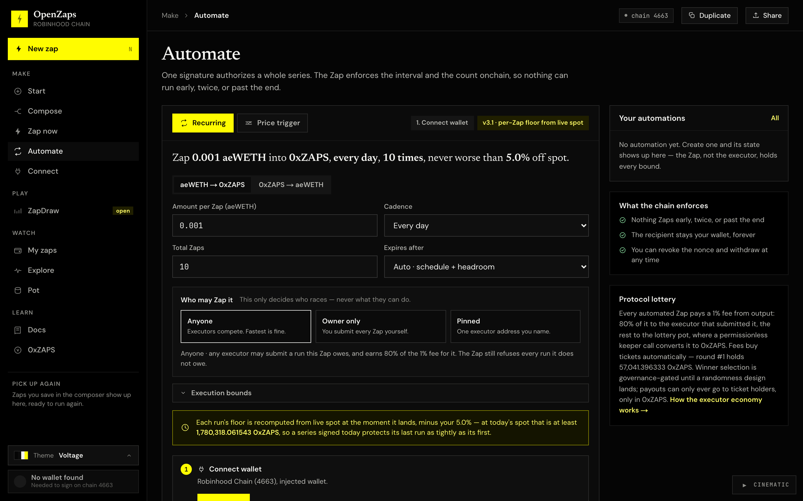

The pot page is where I would send anyone who wants to check whether the fee loop is real rather than
narrated. It holds `57,041.396333` 0xZAPS in the v3.1 round-1 prize, and it names the block the read
came from — 21,408,693. It also does something I want to keep doing: where the public RPC will not
serve the full log scan the conversion and winner history needs, the page says **"history RPC
unavailable"** and shows an em dash. It does not substitute a partial or explorer-sourced number and
present it as the total. A `$0.00` that means "we could not read this" is a lie with a decimal point
in it.

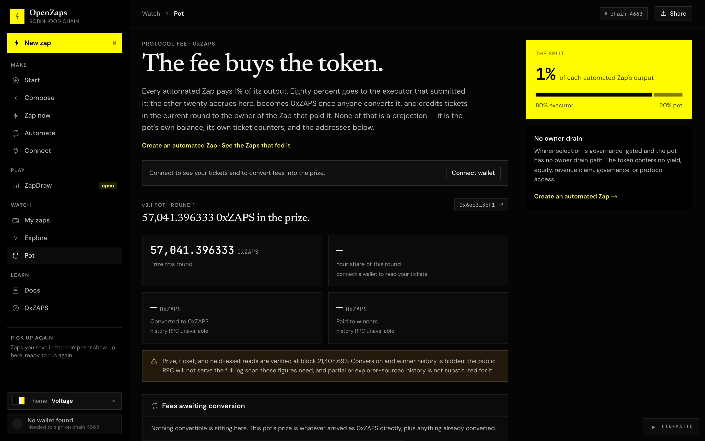

## 3. The composer became the product

Forty-four of the week's non-merge commits touched the builder, and the shape it settled into is
worth describing because it inverts the usual DeFi-UI ordering. You do not pick a protocol and then
discover what it lets you do. You pick an outcome — *zap in to 0xZAPS*, *zap out of liquidity to
USDG* — and then inspect every block that outcome compiles to.

Eighteen blueprints ship in the composer, and — this is the part I like — which of them are
*deployable* is not a field in the data. It is computed against the live allowlist at render time, so
a blueprint is badged `deployable` exactly when the chain will currently honour it, `automatable` when
it needs a cadence or a price condition, and greyed when the route it wants is not allowlisted. The
same is true block by block on the canvas. Nothing in the interface can advertise a capability the
deployment does not have, because the interface is not the thing that decides.

The readout on the right is the part I would keep if I had to throw the rest away — blocks seated,
**guard coverage**, estimated gas, and the exact creation fee, all computed before anything touches a
wallet.

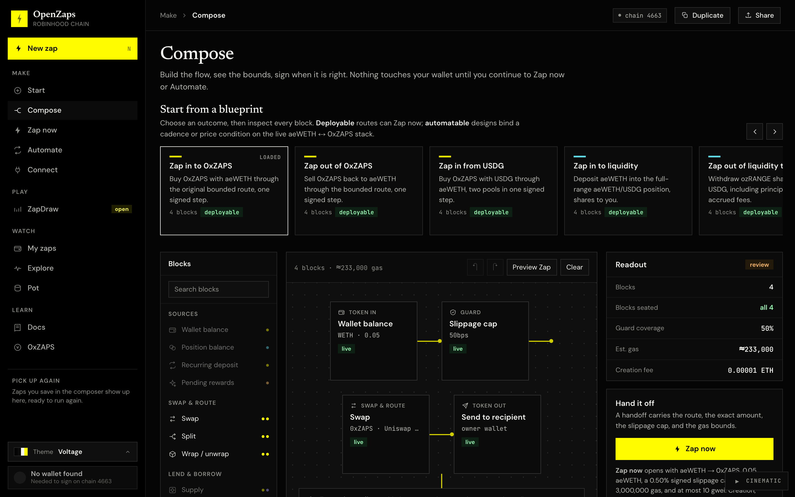

Guard coverage is the one gamified number in the product, and it measures policy *narrowness*. The
score a user is incentivised to maximise is the security property. That is the only kind of
gamification this architecture can wear without refuting itself.

The handoff into signing carries the route, amount, slippage cap, and gas bounds in the URL, and the
sign console treats every one of them as untrusted input. It fills in the same three controls a person
would have typed and then **stops** — it never creates, funds, or signs, because a query parameter is
not consent for an onchain write. It imports a route only if that route is both deployed *and*
currently offered (a vault route only while its vault is seeded), validates the amount at the route's
real decimals rather than assuming 18, and drops the handoff parameters afterwards so a refresh cannot
replay the import over work the user has since done by hand.

My favourite line in that function is a defence against JavaScript rather than against an attacker:
`Number(null)` is `0`, which is finite, so a *missing* slippage parameter would have passed a finite
check and snapped to the 10 bps floor — quietly signing a 0.10% cap nobody chose. Absent now reaches
the same 1.00% default as an untouched slider.

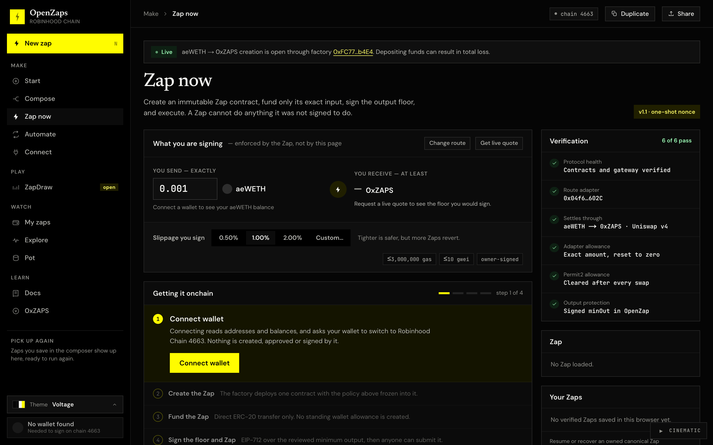

## 4. A creation fee that is not a toll booth

The universal creation gateway went live 25 July at blocks 19,539,599–19,539,642. The app sends
exactly `0.00001 ETH` (`10_000_000_000_000` wei), the gateway atomically converts it through the
pinned aeWETH→0xZAPS adapter against a caller-reviewed minimum output, and credits a separate pot.

| | |
|---|---|
| OpenZapCreationGateway (`1.0.0-candidate`) | `0x02A17a94A0e2B470e931E98079Bf563c94281B2b` |
| ZapCreationFeePot | `0x8E0399A8fF81a5f73Bc76CAEE8a355cF9bb0d863` |

Three properties I care about more than the fee itself. The gateway **preserves the existing v1.1,
v3, and v3.1 factories** — it is additive, not a migration. The pot is bound to the gateway, has no
owner sweep path, and its one-shot `gatewayInstaller()` is zeroed. And after deployment the gateway
held zero ETH, zero aeWETH, zero 0xZAPS, and zero adapter allowance, which was read back from chain
rather than assumed. Total network cost of the deployment was `0.000119145102024 ETH`.

## 5. An agent gets the trigger. It never gets the authority.

This is the ship I would point at if you only read one section.

Everyone building agent infrastructure this year is answering the same question — how do you let an
autonomous process act for a user without handing it the user's keys — and almost everyone is
answering it with a credential: a session key, a delegated signer, a scoped API token. Each of those
is a thing that can leak.

Onchain, an agent's entire authority over a standing OpenZaps authorization is one line:

```solidity
if (intent.executor != address(0) && msg.sender != intent.executor)
    revert ExecutorMismatch();
```

There is no registry, no session key, no delegation. So this feature **ships no credential.** An
agent is connected to a Zap when, and only when, the owner has signed an intent naming its address.
Connection state is *derived* from those signatures rather than stored, which means nothing in the
interface can disagree with the chain.

The blast radius is small and stated exactly: a fully compromised agent can submit a run the capsule
already owes, or refuse to. It cannot change the recipient, amount, cadence, or floor — all four are
inside your signature. It cannot run early, twice, or past the end — cadence and nonce are checked
onchain. It cannot create, fund, or drain.

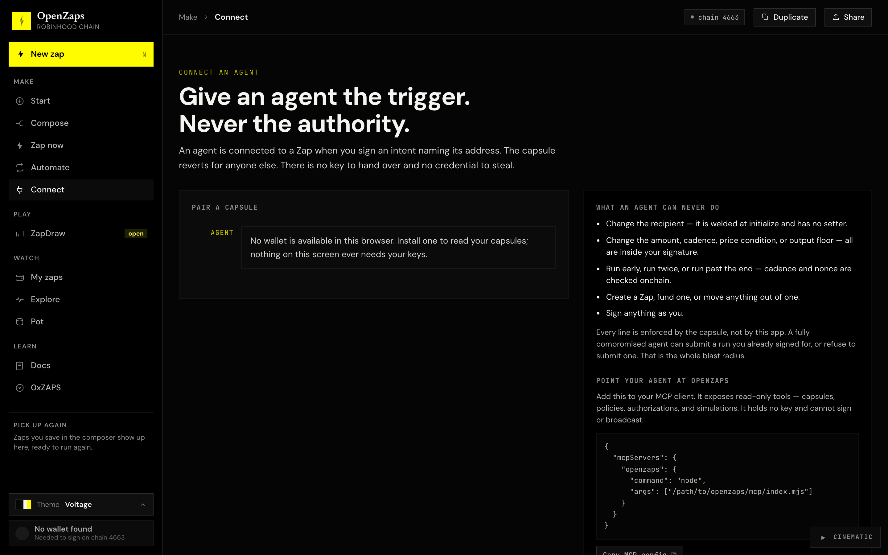

What actually shipped, beyond the copy:

- **An MCP server** (`mcp/`) any client can point at. Hand-rolled JSON-RPC over stdio, zero new
  dependencies, reusing the executor's modules. Two safety classes — read-only and publish — and
  deliberately no third: `simulate_run` calls `submitExecution` with a null wallet client, so the
  broadcast branch is *unreachable* rather than merely unvisited. That distinction is the difference
  between a safety property and a promise.
- **Natural language to a proposed design** (`/api/agent/compose`). The model emits only catalog
  block ids, and that output is round-tripped through `decodeChain(encodeChain(...))` — the same
  hardening an untrusted `?d=` share link gets — before the deterministic compiler judges it. The
  model proposes; deterministic code disposes.
- **Questions answered from a whitelisted fact projection** that excludes the capsule's frozen
  calldata. Answers must cite the fields they rest on, cited values are re-read from the payload, and
  a figure appearing in no fact is refused rather than shown.
- **Graceful degradation as a first-class state.** Without `ANTHROPIC_API_KEY`, every model route
  returns 503 and the connect surface *hides* its free-text composer rather than offering one that
  fails.

There is also an Agents section on `/profile`, narrated deterministically from signatures and
confirmed chain events — zero LLM, zero new fetches. If an agent appears there, it is because you
signed for it.

That page is worth one screenshot for a different reason, and it is the disconnected state on purpose:

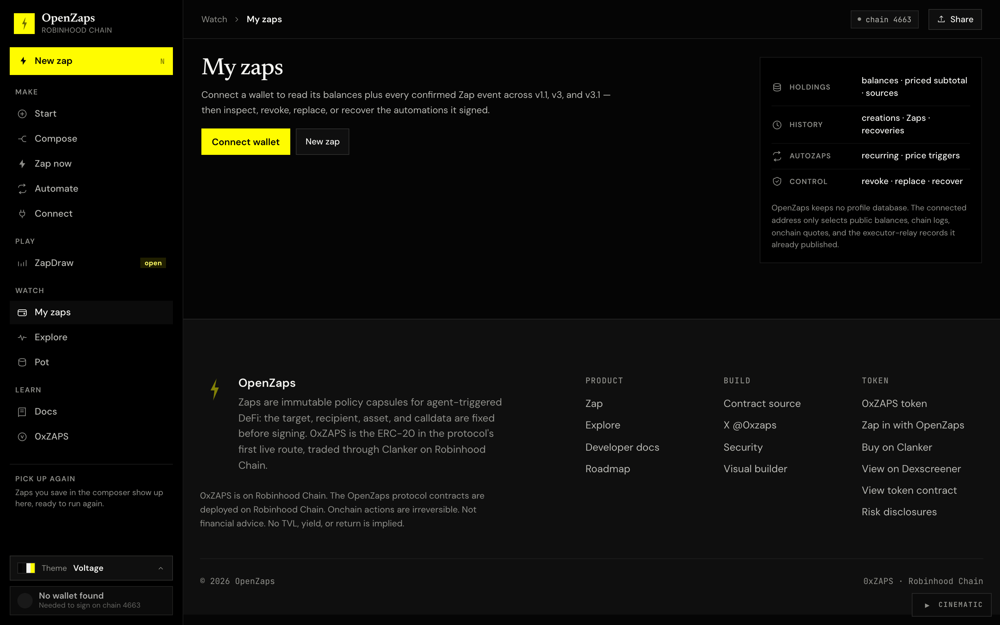

**OpenZaps keeps no profile database.** A connected address only *selects* public balances, chain
logs, onchain quotes, and executor-relay records that were already published. There is nothing to
correlate later because there is nothing being kept — which is a much cheaper privacy story to tell
than a retention policy, and a much harder one to break.

One unglamorous fix landed in the same commit, found by building on top of the thing: `GET
/api/intents` was the only unauthenticated path with no rate limit, and it is the one an agent polls
hardest.

The decision and the rejected alternatives are recorded in ADR-0006.

## 6. ZapDraw shipped. Then it cost two people 2,000,000 0xZAPS in silence.

ZapDraw is a sealed-bid game staked in 0xZAPS, deployed at
`0xb1C9e106a85Ad26603BA3AC89fFa4bE29E6C5336`. It is **not part of the protocol**: not an adapter, not
allowlisted, holds no policy capsule, and no zap route can reach it. A bug in it cannot touch capsule
funds.

Pay a fixed entry. Commit a hashed *draw* — a claim on the round's capacity, in basis points. Reveal
it. At settlement the ascending draws are paid in full until capacity runs out; the first draw that
does not fit is paid nothing, and so is everyone behind it. Undelivered capacity goes to a carry pool
that later rounds draw on.

Two economic properties are load-bearing, and both are enforced by tests rather than comments:

- **A table sweep is never profitable.** An attacker holding every seat controls every draw, can
  always be served in full, and gets the keeper reward back if they settle. Their profit is exactly
  `released − rake`, and `releasableCarry()` caps `released` at the round's own rake — so it is never
  positive, at any seat count. Stated plainly, and the UI now does state it: the pool drains no
  faster than the rake, which makes it a slow rebate, not a jackpot.
- **Ties are not a race.** Equal draws are separated by `keccak256(round, player)`, fixed before the
  round opens. A reveal-order tiebreak would have made every tie a latency auction a bot wins against
  a human — and on a single-sequencer chain, one the block producer could settle by reordering
  reveals already in the mempool.

Then round 1 played out: **two seats, zero reveals.** Both players paid 1,000,000 0xZAPS, both
entries were forfeited to the carry pool, and the page never said so — not while it was happening,
and not afterwards.

Four defects made that easy to reach and impossible to see. The seat read fired once per
`(round, account)` with no retry, and when that single call failed the reveal panel rendered *"You
have no seat in round N. Wait for the next one"* — advice to do nothing, displayed during the six
hours in which doing nothing forfeits the entry. `commit()` computed its commitment against a round
id up to twelve seconds stale, and `commit(bytes32)` takes no round id, so the contract cannot reject
a blob sealed for the wrong round: a seat committed across a settle boundary reverts `BadReveal`
forever, with its salt filed under a round the vault will never look up. The UI never read `settled`
and derived the phase from the browser clock alone, so it kept offering a Settle button that reverts.
And a settled round vanished the instant `currentRound` advanced, so the outcome was never reported
at all.

Fixing that took three more commits. The last one is the one I would want a reviewer to read: an
adversarial review of the first fix produced 31 candidate defects, of which 8 survived two
independent skeptics each, and 7 of those were money-losing.

The worst survivor reached round 1's exact outcome by a road the first fix had not closed. Every
*"you hold a seat"* surface was gated on a connected wallet **and** a live RPC read — so MetaMask
auto-locking after five idle minutes, an account switch, or simply loading the page before the wallet
reconnected made the danger banner, the reveal panel, the Open-my-draw button, and the seal-backup
card all vanish, leaving *"Connect wallet — this does not commit you to a round"* on screen for the
entire six-hour window in which not revealing forfeits the entry.

The fix is a signal that needs neither: `pendingSeals()` reads the local salt vault, which holds a
salt precisely because *this browser sealed it*. That fact does not stop being true when a wallet
locks or an RPC dies. It can only be wrong in the harmless direction — a seal whose reveal confirmed
while the tab was closed still looks pending — and never in the harmful one.

The generalisable lesson, and the reason this section exists: **a warning that depends on the same
infrastructure as the feature is not a warning.** Every "are you sure?" gated on a live read is
absent exactly when reads are failing, which is disproportionately when users are in trouble.

Here is the live table as of this writing, and I am publishing it precisely because it is not
flattering:

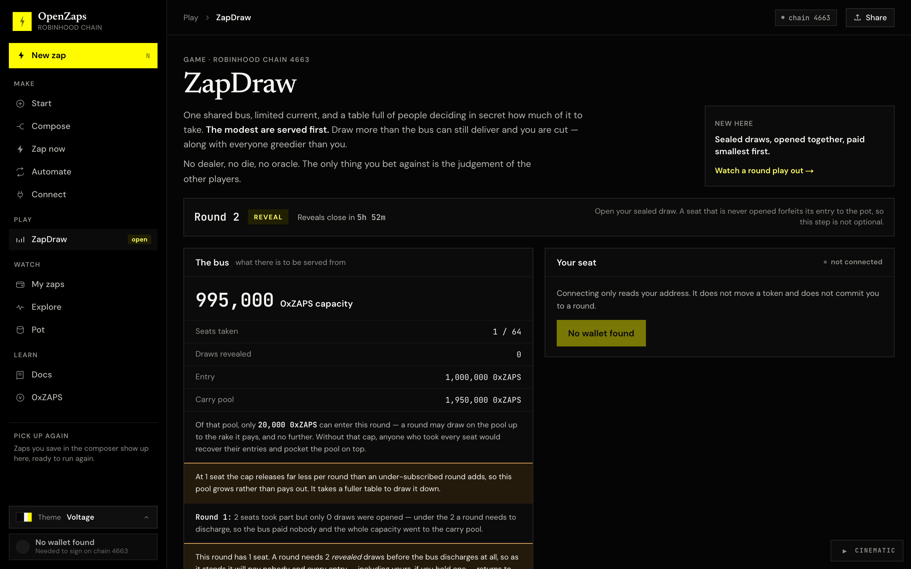

Round 2 has one seat and zero reveals, with 5h 52m left to reveal. The page now says the three things
it previously did not: that a round needs 2 revealed draws before the bus discharges at all, so as it
stands this round will pay nobody; that round 1 paid nobody for that reason and where the money went;
and that at one seat the 20,000-per-round release cap is far smaller than an under-subscribed round
adds, so the 1,950,000 carry pool **is growing, not coming back.** The capacity figure — 995,000 — is
`1,000,000 − 20,000 rake − 5,000 keeper + 20,000 released`, and you can check it.

There is also now a practice table underneath the real one: same rules, same arithmetic — it calls
the same `waterfall()` and `capacityOf()` the live surface uses — with virtual 0xZAPS and no wallet.
It deliberately lets you settle without revealing, and then tells you exactly what that cost. That is
the one lesson the real game otherwise teaches only after it is too late.

## 7. The explainer was teaching a different game

Which brings me to the last change of the week, and the smallest one with the clearest argument.

The `/zapdraw/how` page is a scroll-driven traverse: a pinned camera travelling rightward along one
round's capacity, drawn as a rail a screen and a half long. Paid claims snap solid behind a fixed
"paid to here" line; the refused claim unrolls past the end of the bus; the leftover detaches as the
carry. It is a nice piece of work and it was **an account of a game nobody is playing.**

It opened on the bus already assembled and went straight down the waterfall. Entry, the sealed
commit, and the reveal — the three phases a player actually acts in, and the one whose deadline had
just cost two people their entries — were not in it. An explainer of ZapDraw that cannot show a
missed reveal is an explainer of something else.

So the traverse now walks the whole round, in the order the contract runs it. Five seats pay the same
entry and seal a hidden draw:

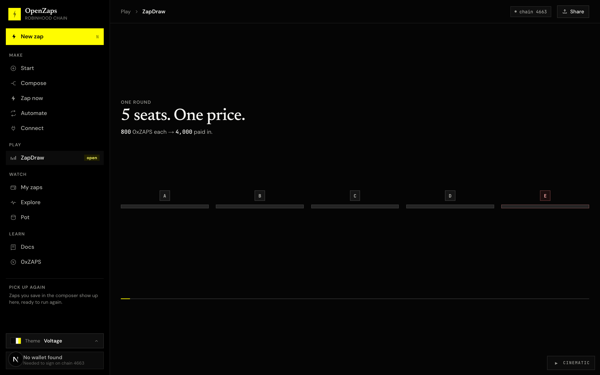

Each seals a draw. Nobody can see anybody else's — that is the whole reason the game is interesting,
and it is also why the salt sitting in your browser is the most dangerous piece of state in the
product:

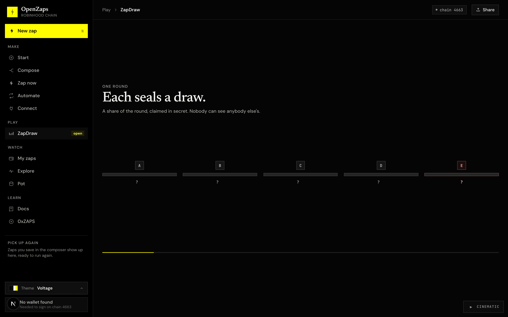

Four come back and open theirs. The fifth does not:

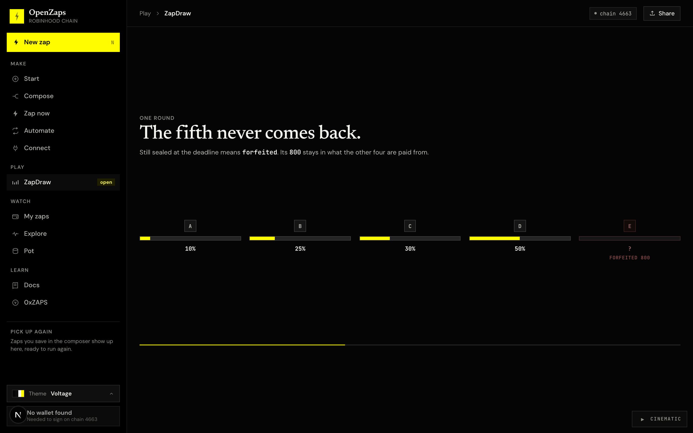

That frame is the point of the rework. The scenario is five seats and four reveals because
`capacityOf` counts **seats** while `waterfall` is handed **reveals** — so an entry that is never
opened is spent into the capacity everyone else is paid from, and pays its owner nothing. None of
those figures is typed into the markup — they fall out of the same `capacityOf` and `waterfall` the
live surface previews with. Take the silent seat away and the bus is measurably smaller, which is
exactly what the test asserts.

Only then does the bus assemble, because the forfeited entry is *inside* the capacity it carries.
Assembling it first would have presented that money as arriving from nowhere.

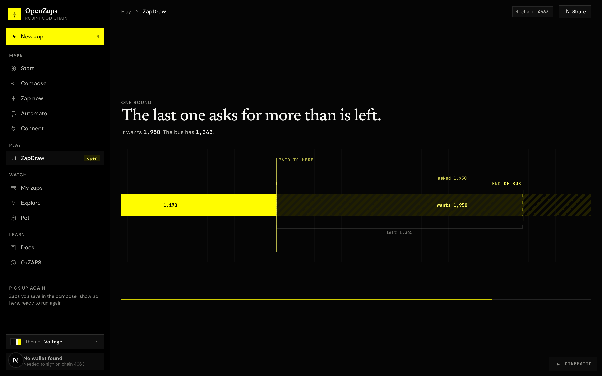

Two bugs surfaced while rebuilding it, and both were invisible by eye:

**The "paid to here" line was lying, by about 170 pixels.** The camera offset was expressed in `vw`
— window units — while the rail it moves is `150%` of its *containing box*. Those agreed until the
app shell put a sidebar beside the stage, and then diverged by exactly the sidebar's width, parking
the head line past the point payment actually reached. That is the single misreading the whole
composition exists to prevent, and the code comments say so. It survived because the test asserted a
*value* — an expression that reduces to `-32`, true for exactly one viewport width. It now asserts an
*identity*: the paid-to point lands on the head line at every frame, every width, and every scale. No
wrong unit can satisfy that.

**The closing pull-back claimed to show the whole bus and showed two thirds of it.** Keeping the head
line pinned while squeezing the rail necessarily pushes the start of the round off the left edge, so
the one frame meant to summarise the round was missing two of the three paid claims. The head
position is now *derived* from the reach rather than fixed, which lets the camera frame the whole bus
at the end while the label stays true by construction:

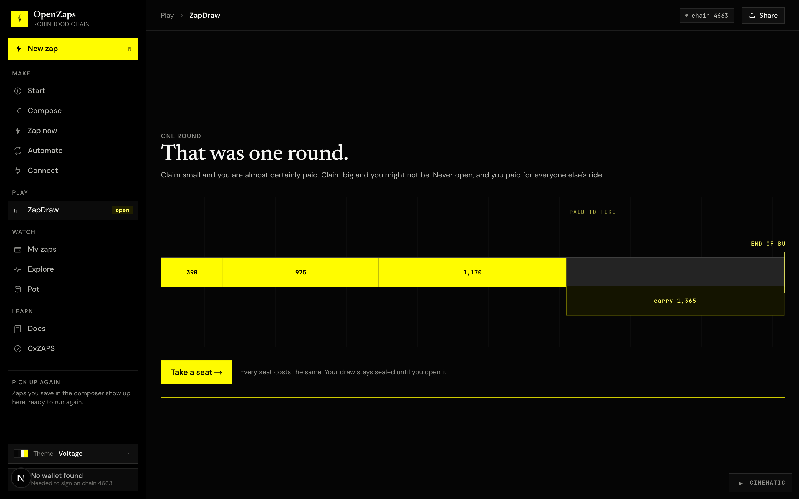

And because the traverse is an enhancement, not the deliverable: anyone on reduced motion, on the
site's Calm setting, on a phone, in a short window, or without JavaScript gets a stepper that teaches
the same round from the same numbers — now including the fifth seat and a four-cell ledger that
distinguishes *cut* from *never opened*, because they are different mistakes with the same balance.

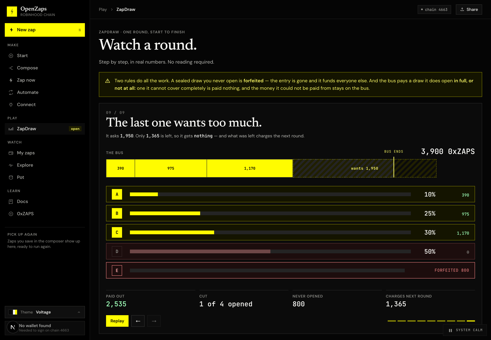

Building that surfaced a third bug, and it is the one I would most easily have shipped. Below 544px
the stepper hides the amount column — reasonable, because the percentage beside it says the same
thing. Except on the forfeited row, which has no percentage either, because its draw was never
revealed. So on a phone the most important row in the scenario was a badge, an empty bar, and silence.
Verified fixed at 375px and 320px:

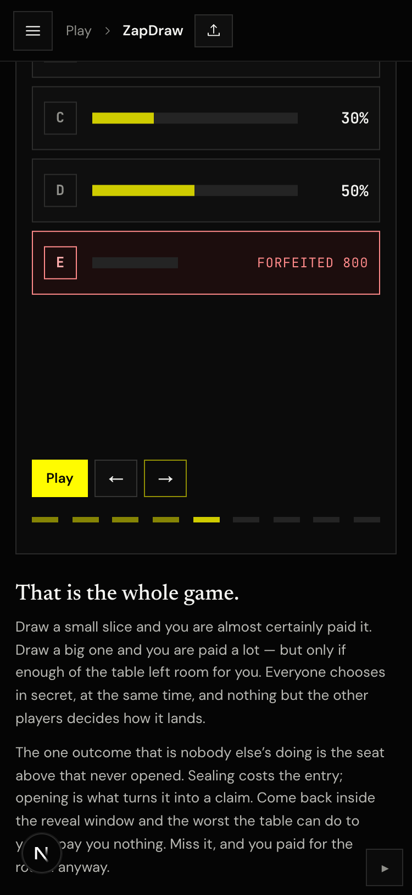

Thirty tests now pin what the animation asserts about the game, up from nineteen. They are not
rendering tests. Each one pins a claim the picture makes — the class of bug that produces a beautiful
page teaching a rule the contract does not implement.

## 8. Five themes, one shell

Briefly, because it is infrastructure rather than a feature: the app was rebuilt on a five-theme
token layer keyed off `data-oz-theme`, with Voltage as the default, and a persistent shell that owns
the scroll for every screen. Every colour, shadow, and radius resolves from tokens. The Zap
vocabulary was made consistent across screens in the same pass — the object you create is a *zap*,
and one execution is also *a zap*, which the copy now handles deliberately rather than accidentally.

The sharp edge, recorded here because it will bite the next person: the landing page pins its own
copies of the tokens the shared primitives read. Point a shared primitive at a token the landing does
not pin and `/` repaints with whatever theme the app is set to — no error, no failing test, just a
bone-white hero button on a black page.

## 9. What is actually live

| | |
|---|---|
| Chain | Robinhood Chain mainnet, 4663 |
| Core v1.1.0 | Factory `0xFC775017b25d2458623E2f3E735A4B750dD8b4E4`, impl `0x2a5EB455952d25b8060Ee933d2bADB022c7aE11A` |
| Automation | v3 `0x70FCFD…17e9`, v3.1 `0xDA5f50…f2E1` |
| Creation gateway | `0x02A17a94A0e2B470e931E98079Bf563c94281B2b`, fee `0.00001 ETH` |
| ZapDraw | `0xb1C9e106a85Ad26603BA3AC89fFa4bE29E6C5336`, entry 1,000,000 0xZAPS, 6h/6h windows, 200/50 bps |
| 0xZAPS | `0xDd90bFa4adC7F4401E611AbaC692D939F9F4CB07` |
| Governance | `0x5a52D4B820Ae7F02880d270562950918ACb14aA2` (nodar.eth) |

A mainnet smoke zap, since a note like this should contain at least one live number: zap
`0x0006e5C42776239Db6abAeF3fdf22BbCfA8Cb5b4`, execution
`0x30637132e29de0a29181f1ae3392acf947351702966eb22a5ea03d6faa845aa6` — `0.00005` aeWETH in,
`170800.958093014101263641` 0xZAPS out, nonce consumed, balances and transient allowances back to
zero.

And the aggregate, which matters more than the smoke test because nobody staged it:

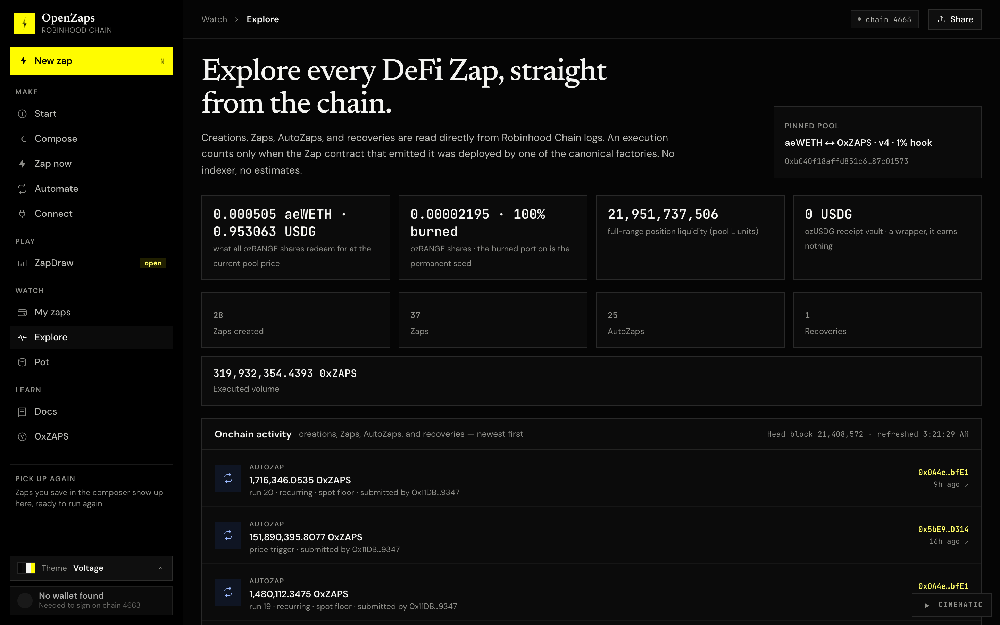

**28 zaps created, 37 executions, 25 of them automated, 1 recovery, 319,932,354.4393 0xZAPS of
executed volume**, at head block 21,408,572. There is no indexer behind that and no estimate in it —
the page reads Robinhood Chain logs directly, and an execution counts only when the contract that
emitted it was deployed by one of the canonical factories. Anything else is somebody else's event.

The recent rows are the part I did not expect to be able to show this week: `run 20 · recurring · spot
floor` and `run 19 · recurring · spot floor`, alongside a `price trigger` run. Those are v3.1
relative-floor executions, which means the end-to-end create → sign → relay → execute path for
per-run floors priced from live spot is not a candidate any more — it is a series in progress, on its
twentieth run, submitted by an executor that holds no authority over the capsule beyond the address in
the owner's signature.

Two smaller readings on that page I want on the record because they are the honest kind: `ozUSDG` is
`0 USDG` and labelled *"a wrapper, it earns nothing"*, and the range vault's permanent seed is shown
as `0.00002195` shares, `100% burned`. The seed cannot be withdrawn by anyone, including us, which is
the standard defence against the empty-ERC-4626 donation attack — and it is stated on the page rather
than buried in a comment.

The 0xZAPS token page leads with what the token is *not*, and the code backs the copy: no governance,
no staking, no revenue claim, no fee rights, no protocol access. Creating, funding, executing, and
recovering a zap never require holding it.

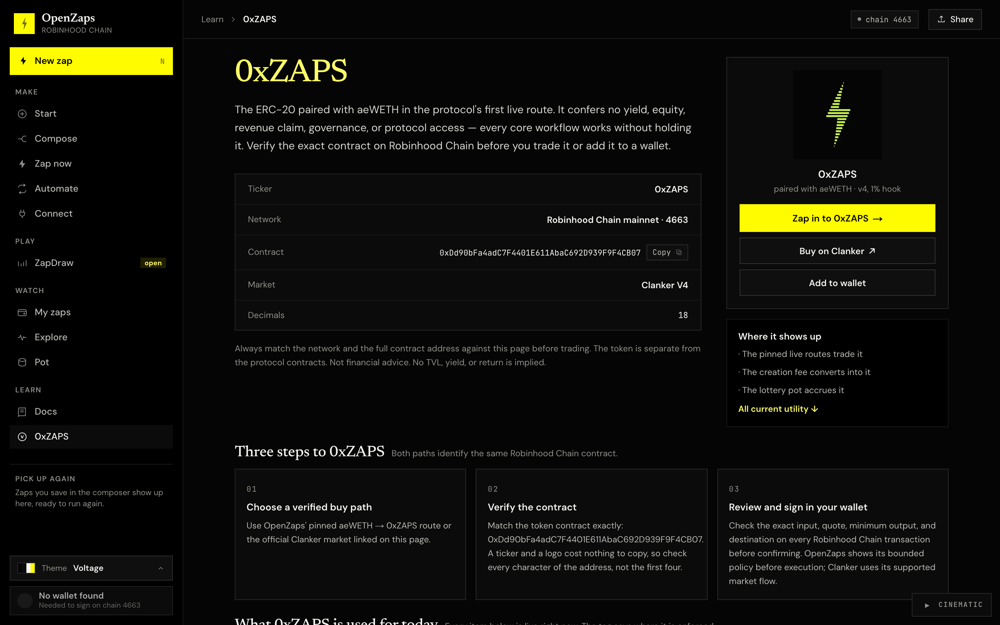

## 10. What I would not point real money at yet

I would rather write this section than have someone else write it.

1. **No external audit.** Every contract above is internally, fork, and mainnet tested; none has had
   professional third-party review. The invariant spec in the repo is the verification *target*, not
   a completed proof. `emergencyExit` exists for exactly this reason: owner-only, unconditional,
   routing through no adapter.
2. **Governance is one EOA.** The registry and allowlist owner is a single key. It cannot redirect
   funds or alter a policy — the bound is real — but it can pause the fast path of any zap by
   de-allowlisting. The repo's own docs call this "not a production posture," which is the correct
   thing to say. A Safe behind a timelock is the next move.
3. **`ZapVault` (`ozUSDG`) is unaudited, unseeded, and earns nothing.** `totalAssets()` is
   `asset.balanceOf(vault)` — a receipt wrapper, not a yield product, and it must never be presented
   as one. An empty ERC-4626 is donation-attackable, so while its supply is zero the app fails those
   routes closed rather than offering a route it cannot honour. Do not confuse it with the range vault
   in section 9: that one *is* seeded, and its seed is burned. They are different contracts with
   different states, and the interface distinguishes them.
4. **v3.1 is an unaudited candidate**, and the relative-floor slippage trap in section 2 is a live
   footgun for integrators.
5. **ZapDraw is under-subscribed**, and at one or two seats the carry pool grows faster than the rake
   cap releases it. The page says so now. Do not read that pool as money that is coming back.

The claim on the front page is falsifiable, and the invitation is standing: the factories, the
adapters, the gateway, the game, and a funded zap are all onchain at the addresses above. If you can
make a zap do anything it was not signed to do — reach an unapproved target, leak an approval, dodge
the recipient, survive `emergencyExit` — the thesis is false and I would genuinely rather know.

A zap cannot do anything it was not signed to do. Unlike a roadmap, you can check.

---

*Every figure above was read from chain 4663, from the running application, or from the repository at
commit time. Screenshots in `docs/media/` were captured on 28 July 2026 — the product surfaces from
`www.0xzaps.com` against live chain state, and the `/zapdraw/how` frames from the branch that
introduces them. Moving figures are labelled as such; the ZapDraw round state in section 6 will be
stale by the time you read it, and the contract is the authority, not this note.*
