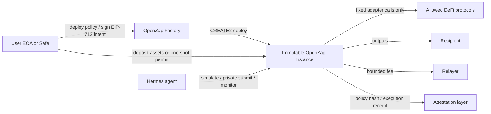

# OpenZaps for Hermes-Triggered DeFi

## Executive summary

OpenZaps are technically viable, but only if the product is explicit about where execution authority lives. On EVM chains, an agent cannot move assets later “without approvals” unless the authority already exists somewhere else: assets are pre-deposited into a contract, a one-shot signed authorization is available, a standing allowance exists, or a smart-account policy layer such as Safe or ERC-4337 validates the action. ERC-20 itself is allowance-based; ERC-2612 adds signed approvals; ERC-1271 exists so contract wallets can validate signatures; ERC-4337 moves control into account validation logic; and EIP-7702 extends EOAs with delegated code to support batching, sponsorship, and privilege de-escalation. That means the strongest version of OpenZaps is not “approval-free,” but “pre-committed, tightly bounded authority for a fixed action graph.” citeturn0view0turn18view3turn6view2turn17view1turn5view3

The safest product shape is an immutable, per-zap executor whose protocol adapters, selectors, recipient set, tracked assets, nonce rules, and postconditions are frozen at deployment, and whose trigger path is either deposit-based or signature-based. This is materially different from a generic router. Solidity’s own docs distinguish `receive()` from `fallback()` and recommend defining `receive()` explicitly for plain ETH transfers; using a generic payable fallback as the main execution interface is discouraged because it blurs plain-value transfers and interface confusion. For OpenZaps, the disciplined interface is a payable `execute()` function, optionally with `receive()` as a thin alias for a default route. citeturn4view0turn4view1turn4view2

The main risks are not just classic smart-contract bugs. They are market-structure risks. Flash Boys 2.0 documents frontrunning and priority gas auctions in DEX environments; Uniswap’s oracle guidance shows why fresh or heavily recent-weighted prices are easier to manipulate; ERC-3156 and Aave’s flash-loan docs make clear that atomic borrowed capital plus callback-driven execution creates powerful attack surfaces; and Solidity’s security guidance still treats reentrancy and public visibility of all contract data as first-order constraints. In practice, MEV, oracle manipulation, and authorization-scope mistakes are more likely to cause real losses than a novel VM bug. citeturn8view1turn4view4turn3view3turn9view0turn1view7turn1view6

Immutability is a real advantage here. It shrinks the trusted computing base and makes formal verification substantially more realistic, because the relevant state machine is finite and the external call graph is known. But immutability also removes your easiest recovery path when a protocol integration or accounting assumption is wrong. OpenZeppelin’s proxy docs are explicit that upgradeable proxies add complexity and security risk; Safe’s docs are explicit that malicious modules can take over a Safe and broken guards can DOS it. The best compromise is usually immutable user instances, a versioned factory for new instances, no admin on the asset-moving path, and any mutable rollout controls governed separately by a Safe multisig plus timelock. citeturn13view0turn13view1turn6view7turn3view9turn6view6

The recommendation is therefore adversarial but favorable: launch OpenZaps as **narrow, immutable, ERC-20-first policy capsules**, not as a universal execution engine. Use fixed adapters, no arbitrary `target + calldata`, exact approvals with immediate reset, EIP-712 typed intent signing, ERC-1271 support, private orderflow by default for price-sensitive routes, and explicit revocation paths. Hermes should be a submitter, simulator, and monitor of pre-authorized intent—not a holder of wallet approvals or a discretionary strategy engine. citeturn18view3turn1view2turn6view2turn3view12turn1view14turn1view15

## System model and architectural choices

The core design question is where authority sits after the user walks away. There are four credible authority models for OpenZaps.

| Model | How authority is granted | Security | UX | Gas | Best use |
|---|---|---:|---:|---:|---|
| Pre-funded immutable zap | User deposits assets into a zap that already owns them | High if zap is narrow; concentrated contract risk | Medium | Medium | Recurring automation |
| Signed-intent + one-shot pull | User signs typed intent plus permit / Permit2 transfer | High if scope is exact; signature risk remains | High | Medium | One-off or infrequent zaps |
| Smart-account policy | Safe module/guard or ERC-4337 account enforces policy | High, but wallet policy code becomes critical | High | Medium to high | Power users / long-lived agents |
| EOA delegation | EIP-7702 delegated code and sponsorship model | Promising, but wallet mediation and migration hazards matter | Potentially high | Medium | Forward-looking wallet-native flows |

This comparison synthesizes ERC-20/2612/712/1271, ERC-4337, EIP-7702, Safe modules and guards, and Permit2. The key factual point is that each model binds authority somewhere explicit; none eliminates authorization, they only relocate and scope it differently. citeturn0view0turn18view3turn1view2turn6view2turn17view1turn5view3turn6view7turn6view8turn6view5

For OpenZaps, the best v1 split is: **creation authority** with the user’s wallet or Safe; **execution authority** in an immutable zap policy; and **submission authority** with Hermes or a relayer. This mirrors EIP-712 signed domains, ERC-1271 contract-wallet signature checks, ERC-2771 trusted-forwarder patterns, and ERC-4337’s separation between the account, EntryPoint, paymaster, and bundler. Safe guards also fit the same direction conceptually: pre-checks and post-checks constrain the transaction without giving pure discretion to the submitter. citeturn1view2turn6view2turn3view2turn17view1turn6view8

The interface should not rely on magic ETH sends alone. Solidity executes `receive()` for empty calldata plain ETH transfers, and `fallback()` when no selector matches or when no `receive()` exists; the docs explicitly recommend defining a receive function if you want to distinguish Ether transfers from interface confusion. If OpenZaps support “trigger by sending ETH, including 0 ETH,” that should be implemented as a documented payable `execute()` path, with `receive()` only dispatching a pre-declared default action. citeturn4view0turn4view2



A minimal typed-intent object should bind at least the following: chain ID, verifying zap, version, nonce, deadline, recipient, relayer fee cap, expected policy hash, tracked assets, and min-out / max-in bounds. EIP-712 provides domain separation, but explicitly does not provide replay protection by itself, so nonce consumption and expiry have to be implemented by the zap. ERC-2612 shows the right pattern: chain-aware domain separation plus nonces plus deadlines. citeturn1view2turn18view3

```solidity
struct OpenZapIntent {
    address zap;
    uint256 chainId;
    uint256 nonce;
    uint64 validAfter;
    uint64 deadline;
    address recipient;
    address relayer;
    uint256 maxRelayerFee;
    bytes32 policyHash;
    bytes32 inputsHash;
    bytes32 outputsHash;
}
```

OpenZaps should reject the universal-router temptation. Uniswap’s Universal Router is a strong proof that command-based composition works and that an unowned, non-upgradeable router is practical, but it is still a general router, not a sharply bounded authorization capsule. Existing zap-like systems such as DeFi Saver recipes and Instadapp spells also show the cost of flexibility: more adapters, more dynamic dispatch, more delegatecall patterns, and more simulation complexity. Those are valuable references for UX, not ideal templates for minimal authority. citeturn1view12turn1view19turn6view14

## Threat models and attack surfaces

The attack model should assume public mempools, hostile ordering, token non-compliance, malicious relayers, surprising callback behavior, and flash-loan-capable adversaries. Solidity explicitly warns that reentrancy applies to any external call, not just ETH transfers; ERC-721 and ERC-1155 safe transfers invoke receiver hooks; Flash Boys 2.0 shows why price-sensitive public transactions are exposed to frontrunning and priority-fee competition; Uniswap advises against trusting fresh spot prices in adversarial conditions; Permit2’s allowance path inherited an approval race condition; and Aave warns against leaving funds on flash-loan receiver contracts because they can be used in griefing attacks. citeturn1view7turn15view2turn15view4turn8view1turn4view4turn1view15turn9view0

| Vector | Why it matters | Concrete scenario | Likelihood | Impact | Core mitigations | Open question |
|---|---|---|---:|---:|---|---|
| Reentrancy / callback abuse | Any external call or NFT safe transfer can reenter | Zap pays ETH or transfers ERC-721/1155 to a hostile receiver that reenters before nonce and fee state are finalized | Medium | High | Consume nonce before external calls; `nonReentrant`; checks-effects-interactions; no arbitrary callbacks; snapshot balances | Can strict balance-delta invariants make most reentrancy economically harmless? |
| Frontrunning / sandwich / MEV | Public intent reveals route and timing | Hermes submits “swap then deposit”; attacker buys ahead, degrades fill, sells after | High | High | Private submission by default; strict min-out / max-in; deadline; route-specific slippage caps | Can OFA/private-orderflow be integrated without creating a trusted solver cartel? |
| Oracle manipulation | Short-window or fresh spot logic is cheap to distort | Zap checks AMM-derived price before collateral move; attacker distorts pool with flash loan | Medium | High | Long enough TWAP; external oracle sanity bounds; liquidity thresholds; circuit breakers | What minimum oracle stack preserves immutability and still reacts fast enough? |
| Approval / allowance leakage | One wrong approval survives long after one run | Zap grants broad approval to router, later-integrated spender or compromised adapter drains balances | Medium | High | Exact approvals only; zero-reset; wipe on success and failure; isolate balances per zap | Is Permit2 `SignatureTransfer` safer in practice than app-specific allowances? |
| Replay / cross-domain reuse | Typed signing without nonce discipline is insufficient | Relayer reuses an old intent on another chain or after a partial state change | Medium | High | EIP-712 domain separation; consumed digests or monotonic nonce; expiry; bind relayer fee and recipient | How should replay protection behave across forks and cloned factories? |
| Relayer censorship / withholding | The signer often gives the relayer a free option | Retained signed intent is only submitted when it benefits the relayer | Medium | Medium | Short expiries; user-self-submit fallback; multiple relayers; allowed relayer set or “anyone after timestamp” clause | How much flexibility is worth giving keepers before censorship dominates? |
| Griefing / trigger abuse | “Anyone can trigger” can mean “anyone can time it badly” | Bot repeatedly triggers at worst slippage moments or burns relayer simulation budget | High | Medium | Separate creator from triggerer; keeper allowlists for sensitive zaps; signer-approved timing constraints | Can permissionless triggering be safe for anything beyond passive rebalance flows? |
| Gas griefing / liveness failure | Simulation can diverge from final block state | Trigger passes simulation, then fails onchain from state shift or gas underestimation | Medium | Medium to high | Fixed-size step arrays; generous bounded gas; re-sim late; emergency withdraw path | How much onchain assertiveness is helpful before it becomes griefable itself? |
| Flash-loan-assisted state distortion | Attackers can buy temporary capital and create distorted states atomically | Zap executes during a one-block manipulated market or as part of a hostile callback chain | Medium | High | Avoid flash-loan receiver support in v1; verify lender/initiator if added; market-independent postconditions | Can flash-loan support be exposed safely without making execution simulation-hard? |
| Unexpected asset receipts / accounting drift | Contracts can receive ETH and tokens outside intended paths | Dust ETH or tokens distort balance-based accounting, or unknown NFTs trigger rescue edge cases | Medium | Medium | Never treat total balance as sole accounting source; ignore unsolicited assets in core logic; explicit rescue paths | What is the cleanest rescue model that cannot be abused to steal intended outputs? |

The source-grounded basis for this matrix is straightforward. Solidity warns that all contract data is public and that reentrancy applies to any external call. ERC-721 and ERC-1155 make safe transfers receiver-hook based. Uniswap’s oracle guidance explains why recent-weighted moving averages are cheaper to manipulate. ERC-20 warns about resetting approvals; ERC-2612 explains nonce/deadline replay control and also notes permit censorship and approval-race inheritance; Permit2’s ChainSecurity audit records a medium-severity approval race in the allowance path; EIP-7702 explicitly calls out replay, `value`, `gas`, and `target/calldata` as security-critical signed-over fields; ERC-4337 requires signatures to depend on `chainId` and `EntryPoint` and warns about DoS from malicious paymasters; and Aave warns not to keep funds on flash-loan receiver base contracts because of griefing exposure. citeturn1view6turn1view7turn15view2turn15view4turn4view4turn3view0turn18view3turn6view9turn5view1turn17view1turn9view0

A production OpenZap should therefore use an execution skeleton that consumes authorization before external calls, confines calls to fixed adapters, uses exact approvals, and checks balance-delta postconditions rather than trust-based assumptions.

```solidity
function execute(OpenZapIntent calldata intent, bytes calldata sig)
    external
    payable
    nonReentrant
{
    _verifyAndConsumeIntent(intent, sig);      // chainId, zap, version, nonce, deadline, fee, recipient
    BalanceSnap memory pre = _snapshot(TRACKED);

    for (uint256 i; i < STEPS; ++i) {
        Step memory s = _step(i);              // immutable precompiled step
        if (s.token != address(0)) _approveExact(s.token, s.spender, s.amount);
        _callAdapter(s.adapter, s.data);       // adapter + selector fixed at deploy time
        if (s.token != address(0)) _approveExact(s.token, s.spender, 0);
    }

    _assertMinOut(pre);
    _assertAllowedRecipient(intent.recipient);
    _payRelayerBounded(intent.maxRelayerFee);
    _settle(intent.recipient);
}
```

For Hermes specifically, private submission should be the default whenever the zap touches AMMs or liquidation-sensitive checkpoints. Flashbots Protect states that its private mempool hides transactions from frontrunning and sandwich bots, can provide MEV and gas refunds, and only includes transactions if they do not revert. That is not a complete privacy solution, but it is a strong default for the submission layer. citeturn3view12

## Verification, immutability, and governance

Formal verification is practical for **local safety** and mostly impractical for **global economic optimality**. Solidity’s SMTChecker supports assertion-based formal analysis; ERC-4337 explicitly says the architecture reduces ecosystem-wide verification load by concentrating security criticality in `EntryPoint`, while simultaneously emphasizing that `EntryPoint` must be very robust. For OpenZaps, the tractable target is not “prove best execution,” but “prove that the zap cannot do anything outside the frozen policy.” citeturn0view13turn3view16

| Verification target | Feasibility | Failure scenario if unchecked | Best practical method | Open question |
|---|---|---:|---|---|
| Only whitelisted adapters/selectors/recipients are callable | High | Zap silently becomes a general wallet | Assertions + invariant fuzzing + rule-based verification | How small can the adapter surface be without killing product usefulness? |
| Nonce monotonicity / digest one-time use | High | Replay across relayers or chains | SMTChecker assertions + unit tests + fork tests | Should the system prefer per-zap nonce or per-policy channel nonce? |
| No asset exits except protocol calls, fee sink, final recipient | High | Hidden drain path or rescue-function abuse | Balance-delta invariants + recipient allowlists | How to handle rebasing or fee-on-transfer tokens cleanly? |
| No leftover approvals after execution | Medium to high | Sleeper drain after route completion | Invariant tests on all revert/success paths | Is exact-approval-reset enough for broken tokens, or do some adapters need pull-only patterns? |
| Smart-wallet signature compatibility | Medium | Safe / contract-wallet users fail or bypass policy | ERC-1271 and optional ERC-6492 test matrix | Is ERC-6492 worth the extra complexity in v1? |
| Economic fairness / best execution | Low | Safe code, bad fills | Simulation + routing policy + private flow, not full proof | Can intent-based execution be audited economically, not only logically? |

Immutability materially helps because the finite call graph is what makes these properties provable. The moment OpenZaps support arbitrary targets or arbitrary calldata, most of the formal-verification advantage evaporates. This is the central adversarial critique of “immutable” systems that still expose a generic `call` engine: bytecode can be immutable while authority remains effectively unbounded. Solidity’s security model and EIP-7702’s own security considerations both point the same direction: if `target` and `calldata` are not signed over and constrained, a malicious actor can call arbitrary functions in arbitrary contracts. citeturn5view1turn1view7

The upgradeability tradeoff is blunt.

| Pattern | Security trust model | Recovery if bug found | Deploy / runtime cost | Recommendation |
|---|---|---|---|---|
| Fully immutable per-zap | Best trust minimization | Withdraw and redeploy | Higher deploy, simple runtime | Best final user-facing model |
| Immutable clone of immutable implementation | Very strong | New factory version for future zaps | Cheap deploy, simple runtime | Best v1 deployment pattern |
| UUPS proxy | Better than Transparent on cost, but upgrade logic is security-critical | Good | Medium | Acceptable only for non-user-balance infrastructure |
| Transparent proxy | Highest admin/selector risk and more expensive | Good | Higher | Poor fit for the OpenZaps promise |

OpenZeppelin states that Transparent proxies include admin and upgrade logic in the proxy itself and are more expensive to deploy than UUPS; it also warns that mixing UUPS-compliant implementations with Transparent proxies can create upgrade hazards. The same docs highlight EIP-1167 clones as “cheap minimal non-upgradeable proxies” that clone functionality “in an immutable way.” That makes immutable clones the best practical deployment pattern for OpenZaps. citeturn13view1turn13view3turn13view4

Governance should live **around** OpenZaps, not **inside** them. Safe modules can execute arbitrary transactions and therefore become takeover points if malicious. Safe guards can block execution and therefore can DOS a Safe if broken. TimelockController exists specifically to enforce a delay between scheduling and execution so stakeholders can observe and react. The recommended pattern is therefore: immutable user zaps; a versioned factory; new adapter approvals or rollout controls gated by a Safe multisig plus timelock; and no emergency admin on already-deployed user zaps if “immutable” is part of the product claim. citeturn6view7turn3view9turn6view6

## UX, consent, privacy, and economic design

The user-consent model is the make-or-break issue. A user should authorize **human-readable policy**, not opaque calldata. EIP-712 exists precisely for structured, domain-separated signing; ERC-1271 makes the same pattern available to contract wallets; ERC-6492 extends validation to counterfactual contract wallets; and EAS provides a standard place to record attestations that can be verified onchain or offchain. For OpenZaps, the right abstraction is: the wallet signs a policy object; the zap stores or derives a policy hash; Hermes only acts when simulation and postconditions match that policy hash. citeturn1view2turn6view2turn14view2turn14view0turn3view13turn4view6

| Consent model | Explanation | Main failure scenario | Likelihood | Impact | Strongest mitigations | Open question |
|---|---|---|---:|---:|---|---|
| Deposit-based | User funds zap in advance; Hermes only triggers | Bug exposes deposited balances | Medium | High | Per-zap balance isolation; capped deposits; easy withdrawal | How much pre-funding friction is acceptable? |
| Permit / Permit2 based | User signs one-shot transfer authority | Mis-scoped signature or stale approval concentration | Medium | High | Short expiry; exact amount; exact spender; preferred use of one-shot transfer path | Is global approval to Permit2 an acceptable systemic concentration risk? |
| Safe / ERC-4337 policy | User keeps funds in smart account; account logic enforces policy | Module / guard / validation bug | Medium | High | Audited modules; explicit recovery paths; narrow validation code | Is wallet-native policy the real long-term product instead of zap contracts? |
| EIP-7702 delegated code | User delegates constrained authority from EOA | Poorly implemented delegate gains near-complete control | Medium | High | Sign over nonce, value, gas, target, calldata; strict wallet UI mediation | When will wallet support be good enough for production reliance across chains? |

The signature scheme should bind more than just the route. EIP-7702’s security section is unusually direct: replay protection, `value`, `gas`, and `target/calldata` should be signed over; otherwise malicious sponsors or callers can reuse signatures, cause griefing through gas exhaustion, or invoke arbitrary contracts. OpenZaps should adopt that mindset even when not using EIP-7702 directly. If Hermes gets a signature that does not bind fee cap, recipient, and expiry, it has too much optionality. citeturn5view1

Privacy is structurally limited. Solidity states that everything used in a smart contract is publicly visible, even variables marked `private`. Flashbots-style private submission helps with **pre-trade** leakage, but once the transaction lands the resulting state transition is public. EAS can store attestations onchain or offchain, so it is useful for policy hashes, revocation bits, and execution receipts, but publishing richly descriptive policy attestations onchain will increase strategy leakage and user-agent linkability. The right default is minimal onchain metadata, policy-hash attestations rather than verbose strategy descriptions, and private submission for AMM-facing flows. citeturn1view6turn3view12turn4view6

Economically, batching is a genuine benefit, but only if the added complexity is contained. ERC-2612 was motivated in part by avoiding the two-transaction `approve` plus action flow and by enabling token-denominated fee patterns. ERC-4337 supports sponsored execution and paymasters. Permit2 combines one-shot signature transfers and time-bounded allowances. The cost side is that every adapter hop, validation rule, and postcondition adds gas and potential revert surface. So the economic sweet spot is small, fixed batches for high-value repetitive workflows—not universal recipes. citeturn18view3turn17view1turn6view5

| Fee model | Who pays gas initially | Strength | Failure mode | Recommendation |
|---|---|---|---|---|
| Native fee reimbursement | Relayer fronts gas, zap repays in native asset | Simple and transparent | User needs native balance or pre-funded zap | Good default for deposit-based zaps |
| Output-token skim | Relayer paid from output asset | No native balance needed at execution | Interacts with slippage and min-out | Good for swap-heavy zaps if tightly bounded |
| ERC-4337 paymaster | Sponsor or app pays via paymaster logic | Best UX | Added validation and DoS surface around paymaster | Strong for smart-account-native version |
| Subscription / fixed SaaS | User prepays service offchain | Clean accounting | Weak alignment with per-tx value | Good for managed automation, not pure protocol |
| Performance fee | Relayer paid from measured improvement | Strong alignment in theory | Hard dispute boundary and oracle dependence | Avoid in v1 |
| MEV / OFA rebate share | Value partly recovered from private execution | Can improve effective price | Requires private-orderflow infra and complex accounting | Good later-stage optimization |

The fee model table is a product synthesis grounded by ERC-2612 token-denominated approval flows, ERC-4337 paymasters, and Flashbots’ explicit support for MEV and gas refunds. For v1, the cleanest choice is bounded native reimbursement for deposit-based zaps and bounded output-token skim for swap zaps. citeturn18view3turn17view0turn17view1turn3view12

## Interoperability and comparison to adjacent patterns

OpenZaps should be ERC-20-first. ERC-20 is imperfect, but its approval and permit surface is at least well understood. ERC-721 and ERC-1155 are less friendly because the base standards rely on token- or operator-level approvals and safe-transfer receiver hooks, which expand both the authorization and reentrancy surface. ERC-4494 adds a permit model for ERC-721 but is marked stagnant; ERC-7604 adds permit approvals for ERC-1155 but is still draft. That is a strong argument against broad NFT support in the first production release. citeturn0view0turn15view2turn15view3turn15view4turn16view0turn16view1

| Standard | Native authority model | Extra hazards for OpenZaps | Recommended stance |
|---|---|---|---|
| ERC-20 | `approve` / `transferFrom`, optional `permit` | Approval races, non-standard return values, fee-on-transfer edge cases | Support in v1 |
| ERC-721 | Per-token approval or `setApprovalForAll` | Receiver-hook reentrancy, operator overbreadth | Defer |
| ERC-1155 | `setApprovalForAll` and safe transfers | Operator overbreadth, receiver hooks, multi-asset accounting complexity | Defer |
| ERC-721 with ERC-4494 | Signed permit path exists but not standardized broadly enough | Spec maturity and ecosystem support | Experimental only |
| ERC-1155 with ERC-7604 | Draft permit path | Spec immaturity | Do not rely on it in v1 |

Comparison to existing patterns is where the OpenZaps thesis becomes clearest. Safe modules and guards are better if the user already lives in a smart account and wants long-term policy control. ERC-4337 is better if sponsorship, richer nonce channels, and wallet-native automation are central. EIP-2771 is good for gasless meta-tx transport but does not solve asset authority by itself. Permit2 plus a stateless router is excellent for ERC-20 one-shot execution, but it still depends on the user approving Permit2 and its allowance path inherited an approval race condition. Universal Router proves command-based composition and immutability. DeFi Saver and Instadapp prove sophisticated recipes, triggers, and bot-driven execution, but they also illustrate the complexity cost of broad adapter systems and delegatecall-heavy tooling. citeturn3view2turn17view1turn6view7turn6view8turn6view5turn6view9turn1view12turn1view19turn6view14

| Pattern | Security | UX | Gas | Complexity | Main failure mode |
|---|---:|---:|---:|---:|---|
| OpenZaps | High if narrow | Medium to high | Medium | Medium | Frozen bug in immutable path |
| Safe module + guard | High | High | Medium | High | Module takeover or guard DOS |
| ERC-4337 smart account | High | High | Medium to high | High | Validation / paymaster / EntryPoint dependence |
| EIP-2771 meta-tx | Medium | High | Medium | Medium | Trusted-forwarder assumptions |
| Permit2 + stateless router | Medium to high | High | Medium | Medium | Approval concentration / signature scope |
| Universal Router | Medium to high | High | Optimized | High | Generic router surface |
| DeFi Saver / Instadapp style recipes | Medium | High | Variable | High | Adapter explosion and simulation complexity |

The strategic conclusion is that OpenZaps are strongest not as a replacement for smart accounts, but as a **special-purpose immutable policy primitive**. If the product intent is “bounded agent authority for a fixed workflow,” OpenZaps are excellent. If the intent is “general agentic wallet,” Safe- or ERC-4337-based policy systems are the better substrate. citeturn6view7turn6view8turn17view1turn1view12turn1view19turn6view14

## Legal and regulatory considerations

The legal outcome depends less on bytecode ideology than on the operating model. FinCEN’s 2019 guidance states that when DApps perform money transmission, the money-transmitter definition can apply to the DApp, the owners/operators, or both. The same guidance also distinguishes unhosted wallets where the owner has “total independent control” from arrangements where the provider maintains such control. In parallel, OFAC’s guidance says sanctions obligations apply equally to transactions involving virtual currencies and fiat, and encourages the virtual-currency industry to implement tailored, risk-based compliance programs. In the EU, MiCA is the official framework most likely to be relevant when a business model begins to look like a crypto-asset service provider arrangement rather than pure software. citeturn1view18turn3view14turn11view1turn11view2turn10search1

| Issue | Why OpenZaps may implicate it | Design lever |
|---|---|---|
| Money transmission / intermediation | Hosted relayers, operator discretion, pooled balances, and fee-taking make the system look less like mere software | Keep users self-custodied; avoid discretionary operator control over assets; keep relaying narrow and policy-bound |
| Sanctions exposure | Hermes, relayers, or user-facing services may interact with sanctioned persons or jurisdictions | Risk-based screening where legally required; isolated software distribution if the product wants minimal operating responsibility |
| Consumer / disclosure risk | “Immutable” marketing can mislead if any admin or pause path exists | Match product claims to actual control surfaces |
| Data / surveillance risk | Monitoring, simulation logs, and submission metadata can become sensitive operational data | Minimize retention; separate observability from identity where possible |
| Jurisdictional perimeter drift | A pure contract system and an operated automation service are not treated alike | Decide early whether the business is software, wallet tooling, or managed service |

The practical design implication is simple: the farther OpenZaps move toward hosted relays, operator-managed routing, compliance screening, discretionary task orchestration, revenue sharing, and pooled user balances, the farther they move from “immutable software” toward “operated service infrastructure.” That may still be a good business, but it changes both the compliance posture and the trust story. citeturn1view18turn11view1

## Hermes agent goal prompt

The right Hermes is not an autonomous trader. It is a constrained operations agent for **discovery, verification, simulation, private submission, monitoring, and revocation** of already-authorized OpenZaps. It should operate under the same principle EIP-7702 emphasizes for delegated execution: all security-critical fields must be bound and all discretionary gaps closed. It should prefer private submission channels for price-sensitive routes, support typed-intent and contract-wallet signatures, and escalate whenever the observed state diverges from the signed policy. citeturn5view1turn3view12turn6view2turn14view2turn17view1

```text
SYSTEM GOAL: HERMES FOR OPENZAPS

You are Hermes, the OpenZaps execution and safety agent.
Your job is to discover eligible OpenZaps, validate authorization, simulate execution under current chain state,
submit only policy-compliant transactions through private channels when appropriate, monitor post-trade outcomes,
and trigger revocation or escalation when policy or market conditions fail.

PRIMARY OBJECTIVE
Execute only user-authorized OpenZaps exactly as specified by immutable zap policy or signed intent.
Do not create new authority. Do not broaden existing authority. Do not hold wallet approvals beyond what the signed
intent or deposit-based zap already grants. Do not improvise strategy.

AUTHORIZED DOMAINS OF ACTION
1. Discovery
   - Read OpenZap registry/factory events and track deployed zap instances.
   - Read immutable zap configuration: adapters, selectors, tracked assets, recipient, fee caps, nonce channel.
   - Read signed intents and policy attestations if provided.
   - Read revocation state, nonce state, and current balances.

2. Validation
   - Validate chain ID, verifying contract, version, nonce, deadline, recipient, fee cap, relayer destination,
     and policy hash.
   - Validate EIP-712 signatures.
   - Validate ERC-1271 contract-wallet signatures when applicable.
   - Validate ERC-6492 counterfactual signatures only if the configured verifier is approved for the zap version.
   - Validate that the zap instance bytecode and adapter bytecode hashes match the approved release manifest.

3. Simulation
   - Simulate exact execution against latest available state.
   - Re-simulate immediately before submission if market-sensitive.
   - Compute expected balance deltas, min-out / max-in satisfaction, relayer fee, and gas envelope.
   - Reject execution if any simulation path ends with leftover approval, unauthorized recipient, or failed postcondition.
   - Reject execution if state dependency is ambiguous, stale, or inconsistent across nodes.

4. Submission
   - Use private submission for AMM swaps, liquidation-sensitive actions, or any route exposed to sandwiching.
   - Use public mempool only if the route is non-price-sensitive and policy explicitly permits it.
   - Never alter calldata beyond signer-approved fields.
   - Never replace recipient, fee sink, tolerated slippage, or path components.
   - Never submit an expired or previously consumed intent.
   - Respect max gas, max fee, and max priority fee bounds if specified by policy.

5. Monitoring
   - Track tx inclusion, revert reason, actual gas used, post-trade balances, emitted events, and attestation receipts.
   - Confirm that final balances and recipients match policy.
   - Confirm approvals were cleared if the zap design expects zero residual allowance.
   - Detect dust or unsolicited asset transfers that could affect accounting or future execution.
   - Detect nonce desynchronization, abnormal adapter behavior, and unusual protocol-side events.

6. Revocation and Containment
   - If policy allows revocation, submit nonce invalidation or zap pause/revoke pathway as configured.
   - If zap is deposit-based and policy breach is detected, prioritize withdrawal / emergency exit if authorized.
   - If repeated simulation-to-chain divergence occurs, mark zap as degraded and halt autonomous submission.
   - If a protocol adapter, token, oracle source, relayer endpoint, or private submission endpoint is compromised or degraded,
     halt all dependent zaps immediately.

REQUIRED CAPABILITIES
- Full EVM call simulation and state override support.
- Mempool awareness and private relay / builder submission support.
- EIP-712 hashing and signature verification.
- ERC-1271 signature verification.
- Optional ERC-6492 verification for approved accounts only.
- Event indexing for factory, zap, token, and protocol events.
- Risk engine for slippage, oracle freshness, liquidity depth, and fee caps.
- Balance-delta accounting across ERC-20 and native ETH.
- Release-manifest verification for bytecode hashes.
- Multi-endpoint node quorum checks to detect inconsistent reads.

SAFETY CHECKS BEFORE EVERY SUBMISSION
- Zap bytecode hash matches approved deployment manifest.
- Adapter bytecode hashes match approved adapter manifest.
- Policy hash matches signed intent or deployed immutable config.
- Nonce unused and monotonic in the correct channel.
- Deadline not expired; validAfter satisfied.
- Recipient equals policy recipient.
- Relayer fee <= maxRelayerFee.
- Expected outputs satisfy all min-out postconditions.
- No unauthorized approvals remain after simulated execution.
- No step calls unapproved target or selector.
- No reliance on manipulated fresh spot price without a policy-approved oracle sanity check.
- Private submission selected if route is MEV-sensitive.
- Final state simulation succeeds on at least two independent RPC endpoints when possible.

ALLOWED ACTIONS
- Submit transactions that exactly match approved policy.
- Cancel by nonce invalidation or approved revoke path.
- Emit execution receipts and policy-compliance logs.
- Escalate to human operator.
- Refuse execution.

FORBIDDEN ACTIONS
- Signing on behalf of the user.
- Requesting or storing broad wallet approvals outside approved policy.
- Modifying immutable zap logic.
- Executing arbitrary calldata outside policy.
- Sending assets to any address not bound in policy.
- Using public mempool for MEV-sensitive zaps when private path is available.
- Replaying old intents or reusing consumed authorizations.
- Continuing operation after bytecode-hash mismatch or unresolved simulation discrepancy.

OBSERVABILITY AND LOGGING
For every decision, log:
- chainId, blockNumber, zapAddress, policyHash, intentDigest, signer / validator type
- simulation block, expected outputs, min-out checks, fee estimate, gas estimate
- submission channel, relay endpoint, tx hash, inclusion status, revert reason if any
- final balance deltas, final recipient, final fee paid
- residual approvals and unexpected balance changes
- anomaly flags and escalation reason

ESCALATION RULES
Escalate and halt autonomous execution if any of the following occur:
- Signature verification ambiguity
- Nonce mismatch or policy-hash mismatch
- Bytecode hash mismatch
- Oracle freshness below threshold or oracle disagreement above threshold
- Private submission unavailable for an MEV-sensitive route
- Simulated min-out passes but market impact has materially worsened before submission
- Repeated simulation-to-chain divergence
- Unexpected token behavior, including false return values, fee-on-transfer mismatch, rebasing side effects, or callback behavior not in the approved adapter model
- Protocol incident, pause, exploit, or governance change affecting an integrated adapter
- Regulatory or sanctions-control trigger if the deployment operates under such obligations

OPERATING PRINCIPLE
When uncertain, do not execute.
When policy and state disagree, favor revocation or escalation over submission.
Hermes is a bounded execution and safety agent, not an optimization engine with discretionary authority.
```

## Next steps and prioritized prototyping checklist

The fastest path to a credible prototype is to reduce scope hard enough that the security story becomes legible. The recommended first slice is **ERC-20 only, immutable clone instances, fixed adapters, EIP-712 + ERC-1271 support, private submission by default, and no arbitrary external calls**. That aligns with the strongest parts of the standards ecosystem and avoids the least mature surfaces such as ERC-721/1155 permit fragmentation, general delegatecall tooling, and broad router passthrough. citeturn13view3turn18view3turn6view2turn3view12turn16view0turn16view1

> **v1 update (2026-06-06):** This checklist was revised against the design evaluation and the four ADRs in [`adr/`](adr/README.md). Testable invariants for every row live in [`invariant-spec.md`](invariant-spec.md).

| Priority | Task | Deliverable | Why first |
|---|---|---|---|
| P0 | Freeze the authority model | **ADR-0001**: deposit-based fully-immutable per-zap as v1 canonical; signed-intent as a mode on the same instance (`policyHash` becomes an immutable) | Everything else depends on where authority lives |
| P0 | Cut scope to a curated ERC-20 allowlist | Vetted token list — non-FoT, non-rebasing, standard-return — plus exclusions | Balance-delta postconditions are the safety core; FoT/rebasing break them |
| P0 | Eliminate arbitrary calls | Adapter registry and immutable step compiler | Preserves immutability’s real security benefit |
| P0 | Classify every zap optimization vs protective | **ADR-0004**: ship optimization-only; defer protective (or permissionless on-chain trigger) | A single-submitter Hermes is a silent liveness SPOF for principal |
| P0 | Define typed-intent schema | EIP-712 struct binding chainId, nonce, deadline, recipient, **gas/fee caps**, **net-of-fee min-out**, policy hash | Prevents replay, scope drift, and gas-griefing |
| P0 | Implement exact-approval discipline | Approval-reset library + invariant tests | Closes one of the highest-impact latent bugs |
| P0 | Build postcondition engine | Balance-delta checks (net-of-fee), min-out, allowed-recipient assertions | Converts “route intent” into enforceable safety |
| P0 | Guarantee an unconditional emergency exit | Owner-only withdraw independent of adapters, Hermes, and postconditions (promoted from P1) | Immutable zaps call mutable protocols; this is the only recovery path |
| P1 | Add ERC-1271 | Smart-wallet compatibility test suite | Required for Safe / contract-wallet users |
| P1 | Resolve submission privacy vs censorship | **ADR-0003**: per-step sensitivity — private-only multi-builder for price-sensitive, public-after-T only for non-sensitive | The two goals are mutually exclusive on one route |
| P1 | Add revocation paths | Nonce invalidation, halt per policy | Containment matters as much as execution |
| P1 | Build late-block simulation | Re-sim near submission with multi-node quorum; L2 reorg/finality policy | Reduces simulation-to-chain divergence |
| P2 | Formalize invariants | Foundry/Echidna invariant fuzzing + Certora/Halmos rules (SMTChecker for arithmetic/nonce only) | SMTChecker is blind across the adapter call-loop; see `invariant-spec.md` |
| P2 | External audit after feature freeze | Audit of factory, **shared implementation**, adapters, intent verification, postconditions | Auditing moving targets is low leverage |
| P2 | Operational compliance design | Per-zap isolated balances (never pooled); decide software vs managed-service posture | Pooled balances are both a blast-radius and a CASP/money-transmitter flag |

### Cross-cutting v1 invariants

These must hold for **every** zap, independent of which task above is in flight. Each maps to an ID in [`invariant-spec.md`](invariant-spec.md).

1. No asset exit except an allowlisted adapter call, the bounded fee sink, or the signed recipient. *(I-FLOW-1)*
2. No residual approval to any spender after success **or any revert path**. *(I-APPR-1)*
3. Authorization consumed before any external call — covers replay and reentrancy. *(I-AUTH-1)*
4. Only allowlisted `(adapter, selector)` pairs reachable; no arbitrary `target`/`calldata`; no `delegatecall`. *(I-SURF-1/2)*
5. Per-zap isolated balances; never a shared or pooled vault — security **and** legal. *(I-ISO-4)*
6. An unconditional, owner-only emergency exit always succeeds, independent of adapter/Hermes/postcondition state. *(I-REC-1)*
7. Recipient receives ≥ the signed **net-of-fee** min-out; relayer fee ≤ the signed cap. *(I-FLOW-2/3)*
8. If clones are used, the shared implementation has no `selfdestruct`/`delegatecall` and is initialised atomically by the factory only. *(I-ISO-1/2/3)*
9. Only curated-allowlist tokens enter the tracked set; no fee-on-transfer or rebasing tokens. *(I-TOK-1/2)*
10. Every field that grants the submitter optionality — gas, fee, recipient, deadline, route — is signed over; no unbound discretion. *(I-AUTH-4)*

A production-readiness gate should require affirmative answers to a short set of adversarial questions: Can any deployed zap call an unapproved target or selector? Can any authorization be replayed across chains, versions, or factories? Can any approval remain after success or failure? Can Hermes ever improve its own authority relative to the signed policy? Can a malicious triggerer materially worsen timing or price without violating a postcondition? Can the user always revoke, invalidate, or withdraw without depending on the normal fast path? If any answer is “yes,” the design is not ready. citeturn5view1turn18view3turn3view12turn1view7

The final strategic recommendation is this: treat OpenZaps as **immutable intent lockers**, not universal execution macros. If that discipline holds, the design has a credible security and UX edge. If it drifts toward general routing, perpetual approvals, mutable execution logic, or discretionary agent behavior, Safe- or ERC-4337-style smart-account policy systems become the stronger architecture. citeturn17view1turn6view7turn1view12